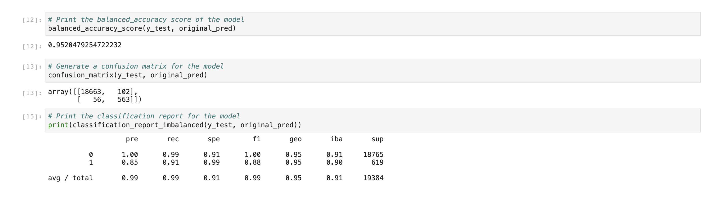
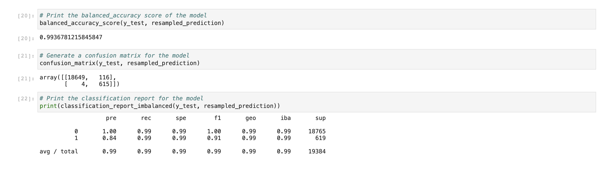

# Module 11 Challenge

This is the repository for my module 12 challenge. In this module challenge, we used supervised machine learning to analyze lending activity and try to predict good loans and risky loans.

The purpose of this analysis was to use a logistic regression model to compare two versions of the same dataset. The first version was the original and for the second version we used an oversampling technique. The financial information we analyzed was a dataset of historical lending activity from a peer-to-peer lending services company. We needed to predict the creditworthiness of borrowers.

We were trying to predict the 'loan_status' variable, which was either 0 which means a healthy loan, or 1 which means a loan at risk of defaulting. In the original dataset there were 75036 healthy loans, and 2500 at risk of defaulting. First we read the data, then we split the data into training and testing sets. Next (only for the second part) we oversampled the data. Next we fit a logistic regression model, made predictions, and evaluated the model. For this challenge, we used LogisticRegression() and RandomOverSampler().

Machine Learning Model 2, where we used oversampling performed a little bit better than the original model, as the accuracy score was higher and the recall was higher (although precision was barely lower).

---

## Technologies

Import the following at the beginning of your jupyter notebook:

```python
import numpy as np
import pandas as pd
from pathlib import Path
from sklearn.metrics import balanced_accuracy_score
from sklearn.metrics import confusion_matrix
from imblearn.metrics import classification_report_imbalanced

import warnings
warnings.filterwarnings('ignore')
```

---

## Example

This first image shows results for the original data. It shows the accuracy score, confusion matrix, and the classification report.



The next image shows results for the resampled data. It shows the accuracy score, confusion matrix, and the classification report.



---

## Contributors

UCB Fintech Bootcamp, Wynham Guillemot 

---

## License

MIT License

Copyright (c) [2021] [UCB Fintech Bootcamp, Wyham Guillemot]

Permission is hereby granted, free of charge, to any person obtaining a copy
of this software and associated documentation files (the "Software"), to deal
in the Software without restriction, including without limitation the rights
to use, copy, modify, merge, publish, distribute, sublicense, and/or sell
copies of the Software, and to permit persons to whom the Software is
furnished to do so, subject to the following conditions:

The above copyright notice and this permission notice shall be included in all
copies or substantial portions of the Software.

THE SOFTWARE IS PROVIDED "AS IS", WITHOUT WARRANTY OF ANY KIND, EXPRESS OR
IMPLIED, INCLUDING BUT NOT LIMITED TO THE WARRANTIES OF MERCHANTABILITY,
FITNESS FOR A PARTICULAR PURPOSE AND NONINFRINGEMENT. IN NO EVENT SHALL THE
AUTHORS OR COPYRIGHT HOLDERS BE LIABLE FOR ANY CLAIM, DAMAGES OR OTHER
LIABILITY, WHETHER IN AN ACTION OF CONTRACT, TORT OR OTHERWISE, ARISING FROM,
OUT OF OR IN CONNECTION WITH THE SOFTWARE OR THE USE OR OTHER DEALINGS IN THE
SOFTWARE.
